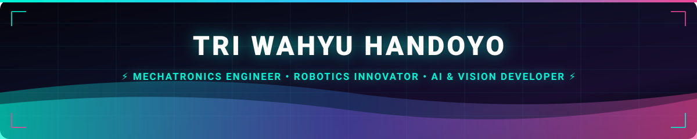

  <!-- PROFILE VIEWS COUNTER -->
  

    
  

  <!-- CYBERPUNK SELF-HOSTED VECTOR HEADER -->
  

  <!-- DYNAMIC RUNNING TEXT TICKER / MARQUEE -->
  

    
  

  <!-- DYNAMIC TYPING SVG ANIMATION -->
  

  <!-- COMPREHENSIVE CONNECT & SOCIAL BADGES (BALANCED CONTRAST) -->
  

    
    
    
    
    
    
    
  

---

### 💡 About Me & My AI-Driven Engineering Philosophy

> *"Just a passionate young maker harnessing the power of Artificial Intelligence to turn ambitious robotics, computer vision, and engineering ideas into reality."*

🎓 **Undergraduate in Mechatronics Engineering Education** at **Universitas Negeri Yogyakarta (UNY)**.

I believe the future of engineering is **human creativity supercharged by AI intelligence**. Most of the autonomous robotics simulators, embedded telemetry pipelines, firmware, and WebGL tools in my repositories are engineered by blending hands-on mechatronics knowledge with **Google Antigravity AI** — achieving ultra-fast prototyping, robust architecture, and production-grade reliability.

- 🤖 **AI-Empowered Maker**: Leveraging autonomous AI Agents to design complex mechanical kinematics, PID control loops, and high-performance web simulators.
- 🏆 **National Robotics Champion**: UNY Robotics Contingent (🥇 1st Place Regional & 🥈 2nd Place National KRTMI 2024 by Ministry of Education & Puspresnas RI).
- 👨‍🏫 **National Vocational Mentor**: Guiding young robotics engineers for the National Vocational Skills Competition (LKS) in Embedded Systems & IoT.
- 👁️ **Computer Vision & Hardware Enthusiast**: Deploying real-time YOLOv8/11 neural networks to edge hardware (ESP32/STM32) for live object detection and tracking.

---

### 🏆 Honors & National Robotics Achievements

| Honor / Award | Organizing Body | Role & Engineering Contribution |
| :--- | :--- | :--- |
| 🥇 **1st Place Champion (Regional I)** | **KRTMI 2024 (BPTI Puspresnas Kemendikbudristek)** | Lead Robotics Programmer — Team Abhinaya UNY |
| 🥈 **2nd Place Runner-Up (National)** | **KRTMI 2024 (BPTI Puspresnas Kemendikbudristek)** | Drivetrain Kinematics & Autonomous Motion Control |
| 🏅 **National Finalist** | **KRTMI 2023 (USM Semarang)** | Autonomous Sensor Navigation & Telemetry Developer |
| 👨‍🏫 **National LKS Mentor** | **SMK National Skills Competition (2025/2026)** | National Mentor for Embedded Systems, IoT & Robotics |

---

### 🛠️ Interactive Tech Stack & Toolbox

  <!-- MODERN SKILL ICONS MATRIX -->
  

    

  <!-- SPECIALIZED EMBEDDED & CAD BADGES (HIGH READABILITY) -->
  

    
    
    
    
    
    
    
    
    
  

---

### 🌟 Featured Robotics Projects & Live Web Simulators

<table>
  <tr>
    <td width="50%" align="center">
      <a href="https://triwahyu45.github.io/Kinematics_Wheels/" target="_blank">
         
        <b>Robotics Kinematics Web Simulator</b>
      </a>
      
High-performance 2D physics simulation for Mecanum, Omni 4W/3W, and Tank drivetrains. Features real-time Gamepad API support, field-centric mode, and oscilloscope telemetry graphs.

      <code>HTML5 Canvas</code> • <code>Physics Kinematics</code> • <code>Gamepad API</code>
    </td>
    <td width="50%" align="center">
      <a href="https://github.com/triwahyu45/Antigravity_WebRemote" target="_blank">
         
        <b>AI Mobile Companion & Web Controller</b>
      </a>
      
Full-featured mobile companion for Google Antigravity with real-time DOM streaming, two-way injection via CDP, diff review viewer, and PWA standalone support.

      <code>FastAPI</code> • <code>WebSocket</code> • <code>CDP</code> • <code>PWA</code>
    </td>
  </tr>
  <tr>
    <td width="50%" align="center">
      <a href="https://triwahyu45.github.io/Portofolio/" target="_blank">
         
        <b>Engineering Portfolio & CAD Archive</b>
      </a>
      
Cyberpunk glassmorphism personal website featuring WebGL 3D model inspector, national robotics competition achievements, and 7 CAD assemblies.

      <code>WebGL</code> • <code>Three.js</code> • <code>Autodesk Inventor</code>
    </td>
    <td width="50%" align="center">
      <a href="https://triwahyu45.github.io/ESP32-OLED-Video-Converter/" target="_blank">
         
        <b>Video to OLED Animation Studio</b>
      </a>
      
Browser-based video-to-byte-array converter with Bayer 8x8 dithering algorithms and PROGMEM optimization for SSD1306 OLED displays.

      <code>Bayer Dither</code> • <code>PROGMEM</code> • <code>SSD1306</code>
    </td>
  </tr>
</table>

---

### 🌐 Connect & Collaborate Across The Web

Feel free to connect with me for robotics collaborations, open-source discussions, or engineering inquiries:

| Platform | Handle / Link | Purpose |
| :--- | :--- | :--- |
| 🌐 **Live Portfolio** | [**triwahyu45.github.io/Portofolio**](https://triwahyu45.github.io/Portofolio/) | 3D Interactive Showcase & CAD Archives |
| 💼 **LinkedIn** | [**Tri Wahyu Handoyo**](https://www.linkedin.com/in/tri-wahyu-handoyo-a5a40026a/) | Professional Network & Career Inquiries |
| 📸 **Instagram** | [**@triwahyu45**](https://instagram.com/triwahyu45) | Personal Engineering Stories & Updates |
| ⚡ **Tech Studio** | [**@detronics.id**](https://instagram.com/detronics.id) | Electronics, IoT & Custom Hardware Works |
| 🌳 **All Links** | [**linktr.ee/triwahyu45**](https://linktr.ee/triwahyu45) | Quick Links to All My Projects & Profiles |
| ✉️ **Direct Email** | [**triwahyu45@gmail.com**](mailto:triwahyu45@gmail.com) | Collaboration & Mentoring Contact |

---

### 📈 Live GitHub Contribution & Activity Analytics

  <!-- ACTIVITY GRAPH (FAST & STABLE CDN) -->
  

---

### 💖 Support My Hardware & Open-Source Research

If my robotics simulators, CAD models, or open-source tools helped your project, consider supporting my hardware experiments:

  
  &nbsp;
  
  &nbsp;
  

---

  

