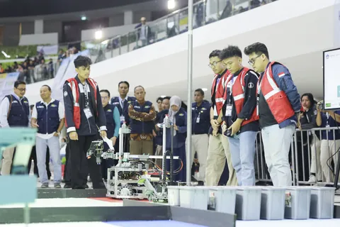
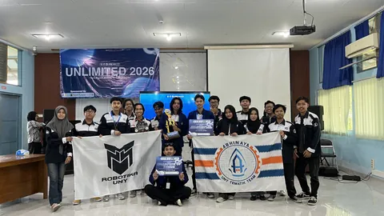
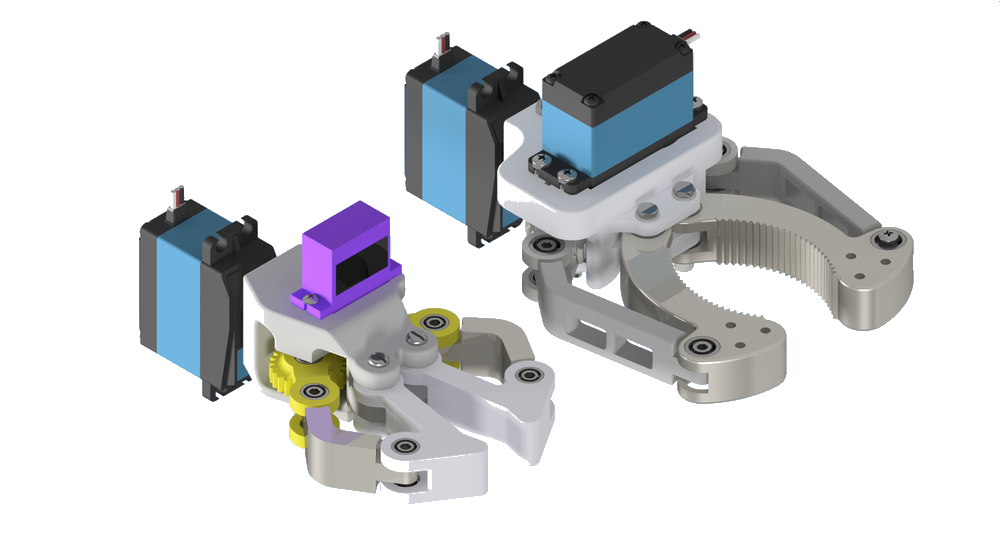
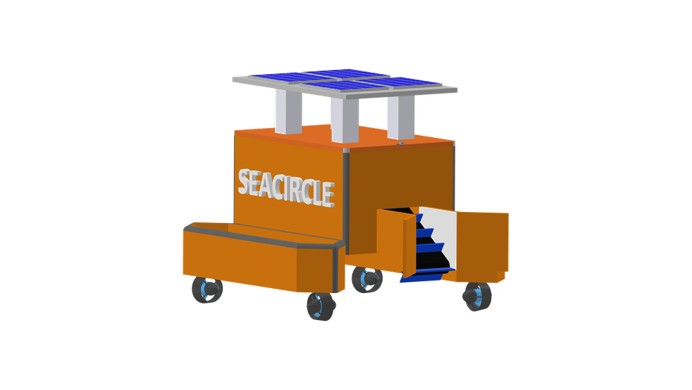

<div align="center">

  <!-- PROFILE VIEWS COUNTER -->
  <p align="right">
    
  </p>

  <!-- CYBERPUNK HEADER BANNER -->
  <a href="https://triwahyu45.github.io/Portofolio/" target="_blank">
    
  </a>

  <!-- DYNAMIC TYPING SVG ANIMATION -->
  <div style="margin-top: 6px; margin-bottom: 12px;">
    <a href="https://git.io/typing-svg">
      
    </a>
  </div>

  <!-- SOCIAL CHANNELS (STRICTLY PRIVACY COMPLIANT - ZERO WA) -->
  <p align="center" style="margin-top: 10px;">
    <a href="https://triwahyu45.github.io/Portofolio/" target="_blank">
      
    </a>
    <a href="https://abhinaya-uny.github.io/AbhinayaUNY_Web/" target="_blank">
      
    </a>
    <a href="https://www.linkedin.com/in/tri-wahyu-handoyo-a5a40026a/" target="_blank">
      
    </a>
    <a href="https://instagram.com/triwahyu45" target="_blank">
      
    </a>
    <a href="https://www.youtube.com/@TriWahyu45" target="_blank">
      
    </a>
    <a href="https://www.tiktok.com/@triwahyu45" target="_blank">
      
    </a>
    <a href="https://instagram.com/detronics.id" target="_blank">
      
    </a>
    <a href="https://linktr.ee/triwahyu45" target="_blank">
      
    </a>
    <a href="mailto:handoyotriwahyu@gmail.com">
      
    </a>
  </p>

</div>

---

### ⚡ Interactive System Diagnostics Terminal

```bash
triwahyu@mechatronics-core:~$ ./diagnostics.sh --profile --verbose
================================================================================
>> OPERATOR        : Tri Wahyu Handoyo (NIM: 22518241023)
>> AFFILIATION     : Universitas Negeri Yogyakarta (S1 Pendidikan Teknik Mekatronika)
>> VOCATIONAL ROOT : SMK Negeri 3 Yogyakarta (Teknik Audio Video - TAV)
>> CORE ROLE       : Lead Programmer @ Tim Robotika Abhinaya UNY (Divisi KRTMI)
>> RECORD / TITLES : 🥇 Juara 1 KRTMI Wilayah I 2024 (Sertifikat: 18322/BPTI/DIKTI/2024)
>>                   🥈 Juara 2 KRTMI Nasional 2024 (Sertifikat: 18869/PPN/DIKTI/2024)
>>                   🥇 Juara 1 Robot Creative UNLIMITED UNDIP 2026
>>                   🏅 Finalis Technocorner Transporter Robot (FT UGM)
>> PRIMARY STACK   : C/C++ • Python • STM32 (CubeIDE/Keil) • ESP32 • Autodesk Inventor
>> VISION & AI     : YOLOv8 / YOLOv11 • OpenCV Edge Computing • Closed-Loop PID
>> SIMULATORS      : 10+ Live Web Applications (Three.js WebGL, Next.js, HTML5 Canvas)
>> CURRENT STATUS  : 🟢 Active in Robotics Research, Embedded Firmware & Web Simulators
================================================================================
```

---

### 💡 About Me & Engineering Focus

> *"Mengintegrasikan rekayasa mekanika presisi, sistem tertanam berkinerja tinggi, dan visi komputer cerdas untuk membangun robotika otonom yang tangguh dan solutif."*

Halo! Saya **Tri Wahyu Handoyo**, mahasiswa S1 **Pendidikan Teknik Mekatronika** di **Universitas Negeri Yogyakarta (UNY)** dengan latar belakang vokasi dari **SMK Negeri 3 Yogyakarta** (Teknik Audio Video).

Fokus rekayasa saya mencakup perancangan sistem robotika otonom dari hulu ke hilir:
- 🤖 **Mobile Robotics & Drivetrain Kinematics**: Ahli perancangan dan implementasi kinematika roda *4WD Mecanum Holonomic* dan *3W/4W Omni-Directional*, kendali loop tertutup PID, serta integrasi odometri gyro/IMU.
- 👁️ **Computer Vision & Edge AI**: Mengembangkan pipeline deteksi objek real-time menggunakan **YOLOv8** dan **OpenCV** yang diintegrasikan ke embedded computer / mikroprosesor untuk pelacakan dinamis di arena kompetisi.
- ⚡ **Embedded Systems & Firmware**: Pemrograman mikrokontroler **STM32** (STM32F103, STM32F401 via STM32CubeIDE & Keil uVision), **ESP32**, dan **Arduino** menggunakan C/C++ bare-metal dan RTOS.
- 📐 **3D CAD & Mechanical Design**: Desain sasis robot modular, sistem transmisi mekanik, dan mekanisme gripper menggunakan **Autodesk Inventor Professional** serta manufaktur aditif (3D Printing).
- 🔌 **PCB Design & Hardware Prototyping**: Perancangan skematik dan layout PCB menggunakan **Autodesk EAGLE**, **KiCad**, dan simulasi **Proteus**, dengan standar perakitan soldering IPC-610.
- 🌐 **Interactive Web Simulators**: Membangun simulator robotika interaktif berbasis web (Three.js WebGL & HTML5 Canvas) agar algoritma kinematika dan elektronika dapat dipelajari dan diuji secara visual sebelum implementasi perangkat keras.

---

### 🌟 Rekam Jejak Kompetisi Robotika & Karya Inovasi 3D CAD

Berikut adalah dokumentasi robot fisik kompetisi resmi dan desain 3D CAD rekayasa terverifikasi:

<div align="center">

#### 🤖 Robot Fisik Kompetisi Resmi

<table>
  <tr>
    <td width="33%" align="center">
      <a href="https://abhinaya-uny.github.io/AbhinayaUNY_Web/" target="_blank">
        <br><br>
        <b>🥇 Robot Otonom KRTMI (Abhinaya UNY)</b>
      </a>
      <p align="left"><small><b>Juara 1 Wilayah I & Juara 2 Nasional KRTMI 2024</b> (Puspresnas Kemendikbudristek). Robot pemilah sampah otonom dengan 4WD Mecanum holonomik, computer vision YOLOv8, sinkronisasi smart basket, dan kontrol PID tertutup.</small></p>
      <code>Mecanum 4WD</code> • <code>YOLOv8 & OpenCV</code> • <code>ESP32 / STM32</code>
    </td>
    <td width="33%" align="center">
      <a href="https://abhinaya-uny.github.io/AbhinayaUNY_Web/#achievements" target="_blank">
        <br><br>
        <b>🏆 Robot Creative (UNLIMITED UNDIP 2026)</b>
      </a>
      <p align="left"><small><b>Juara 1 Robot Creative</b> (Environmental Monitoring & Waste Management, Universitas Diponegoro). Robot terintegrasi sensor lingkungan, telemetri nirkabel, dan otomasi pemilahan sampah cerdas.</small></p>
      <code>Robot Creative</code> • <code>Environmental IoT</code> • <code>UNDIP 2026</code>
    </td>
    <td width="33%" align="center">
      <a href="https://triwahyu45.github.io/Portofolio/#cad-3d-viewer" target="_blank">
        <br><br>
        <b>🦾 Robot Transporter (Technocorner FT UGM)</b>
      </a>
      <p align="left"><small><b>Finalis Technocorner Transporter Robot</b> (Fakultas Teknik Universitas Gadjah Mada). Drivetrain Mecanum holonomik presisi, mekanisme lead-screw motorized gripper, dual driver TB6612FNG, dan kendali PID.</small></p>
      <code>Autodesk Inventor</code> • <code>Mecanum 4W</code> • <code>Lead-Screw Gripper</code>
    </td>
  </tr>
</table>

#### 📐 Inovasi Desain 3D CAD & Karya Tulis Ilmiah (Autodesk Inventor Pro)

<table>
  <tr>
    <td width="50%" align="center">
      <a href="https://triwahyu45.github.io/Portofolio/#cad-3d-viewer" target="_blank">
        <br><br>
        <b>🌾 Robot Inesco (Juara 1 Esai Nasional INESCO 2025)</b>
      </a>
      <p align="left"><small><b>Juara 1 Lomba Esai Nasional INESCO 2025</b> (Universitas Muhammadiyah Purwokerto). Desain 3D CAD assembly robot pertanian cerdas untuk pemilahan dan pengangkutan hasil panen otomatis berbasis multi-sensor telemetri.</small></p>
      <code>Autodesk Inventor</code> • <code>Agri-Robotics CAD</code> • <code>Juara 1 Esai</code>
    </td>
    <td width="50%" align="center">
      <a href="https://triwahyu45.github.io/Portofolio/#cad-3d-viewer" target="_blank">
        <br><br>
        <b>💡 Desain 3D Robot Edukasi AI (FKMPI Fair)</b>
      </a>
      <p align="left"><small><b>Desain 3D CAD Assembly di Autodesk Inventor Pro</b> yang dirancang untuk proposal karya tulis ilmiah <i>Robot Analisis Pemahaman Siswa Berbasis AI</i> pada ajang <b>FKMPI Fair Essay Competition</b> (konsep 3D CAD media edukasi, bukan robot fisik bipedal).</small></p>
      <code>Autodesk Inventor</code> • <code>3D CAD Assembly</code> • <code>FKMPI Fair Proposal</code>
    </td>
  </tr>
</table>

</div>

---

### 🌐 Live Interactive Web Applications & Simulators

Seluruh aplikasi web dan simulator interaktif yang saya kembangkan dapat langsung diuji coba secara live melalui browser serta dipelajari kodenya pada repositori GitHub masing-masing:

<div align="center">

| Aplikasi & Simulator | Akses Live Web | Repositori GitHub | Teknologi Utama | Deskripsi Singkat |
| :--- | :---: | :---: | :--- | :--- |
| **🌐 3D Interactive WebGL Portfolio** | [**Buka Web 🚀**](https://triwahyu45.github.io/Portofolio/) | [**Kode Repo 📂**](https://github.com/triwahyu45/Portofolio) | `Three.js` `WebGL` `Autodesk Inventor` | Portofolio 3D futuristik dengan WebGL 3D CAD Model Inspector langsung di browser, riwayat pendidikan lengkap, dan track record robotika. |
| **🤖 Portal Robotika Abhinaya UNY** | [**Buka Web 🚀**](https://abhinaya-uny.github.io/AbhinayaUNY_Web/) | [**Kode Repo 📂**](https://github.com/Abhinaya-UNY/AbhinayaUNY_Web) | `Next.js 14` `TypeScript` `Tailwind CSS` | Website resmi Tim Robotika KRTMI Abhinaya UNY memuat arsip rulebook KRI 2019–2026, dokumentasi YouTube kompetisi, dan data anggota PDDikti. |
| **🎰 Judoru45 Anti-Gambling Simulator** | [**Buka Web 🚀**](https://triwahyu45.github.io/Judoru45_Game/) | [**Kode Repo 📂**](https://github.com/triwahyu45/Judoru45_Game) | `React` `TypeScript` `Tailwind CSS` | Platform edukasi anti judi online dengan 6 mini games (Slot, Crash, Roulette, Dice, Togel, Skor Bola) membuktikan algoritma house-edge yang dimanipulasi dengan 100% koin virtual gratis. |
| **👓 ToRayBan Meta Video Converter** | [**Buka Web 🚀**](https://triwahyu45.github.io/ToRayBan_Converter/) | [**Kode Repo 📂**](https://github.com/triwahyu45/ToRayBan_Converter) | `Next.js` `FFmpeg WASM` `ExifTool` | Web tool pengonversi video & foto client-side ke resolusi vertikal 1376x1840, rekonstruksi atom MOV QuickTime (Instagram Spin View), dan injeksi metadata EXIF Ray-Ban Meta. |
| **🚀 Kinematics Wheels 2D Simulator** | [**Buka Web 🚀**](https://triwahyu45.github.io/Kinematics_Wheels/) | [**Kode Repo 📂**](https://github.com/triwahyu45/Kinematics_Wheels) | `HTML5 Canvas` `Gamepad API` `Physics` | Simulator fisika kinematika 2D interaktif untuk robot Mecanum, Omni 3W/4W, dan Tank drive dengan visualisasi vektor gaya, osiloskop telemetri, dan dukungan gamepad controller fisik. |
| **📺 ESP32 OLED Video Converter** | [**Buka Web 🚀**](https://triwahyu45.github.io/ESP32-OLED-Video-Converter/) | [**Kode Repo 📂**](https://github.com/triwahyu45/ESP32-OLED-Video-Converter) | `JavaScript` `Bayer Dithering` `PROGMEM` | Konverter video browser ke array byte monokrom C++ PROGMEM untuk layar OLED SSD1306/SH1106 pada ESP32 & Arduino dengan algoritma Bayer 8x8 dithering. |
| **🖐️ Flex Sensor Web Simulator** | [**Buka Web 🚀**](https://triwahyu45.github.io/Flex-Sensor-Web-Simulator/) | [**Kode Repo 📂**](https://github.com/triwahyu45/Flex-Sensor-Web-Simulator) | `HTML5 Canvas` `Web Audio API` `JS` | Simulator interaktif kelengkungan flex sensor jari dan kalkulasi resistansi voltage divider dengan visualisasi gerakan artikulasi tangan dinamis. |
| **🎹 Gamepad Piano Web Audio** | [**Buka Web 🚀**](https://triwahyu45.github.io/GamepadPiano/) | [**Kode Repo 📂**](https://github.com/triwahyu45/GamepadPiano) | `Web Audio API` `Gamepad API` `Synth` | Instrumen piano synthesizer polifonik berbasis browser yang dimainkan menggunakan gamepad / joystick fisik melalui Web Gamepad API secara latensi rendah. |
| **📋 Wahyu's Plan Notion-Style App** | [**Buka Web 🚀**](https://triwahyu45.github.io/Wahyus-Plan/) | [**Kode Repo 📂**](https://github.com/triwahyu45/Wahyus-Plan) | `React` `Tailwind CSS` `LocalStorage` | Aplikasi manajemen produktivitas personal gaya Notion dengan Kanban board tugas, roadmap kalender, dan sinkronisasi penyimpanan lokal. |
| **🎯 Simulasi Omni Technocorner 2026** | [**Buka Web 🚀**](https://triwahyu45.github.io/simulasi-omni-technocorner-2026/) | [**Kode Repo 📂**](https://github.com/triwahyu45/simulasi-omni-technocorner-2026) | `HTML5 Canvas` `Vector Kinematics` | Simulasi trajektori arena Technocorner Transporter UGM dengan kalkulasi matriks invers kinematika roda omni 3W/4W. |

</div>

---

### 📂 Interactive Deep Dives & Engineering Formulations

<details>
<summary><b>🤖 [EXPAND] Drivetrain Kinematics & Inverse Control Matrix</b></summary>
<br>

Formulasi invers kinematika roda **4WD Mecanum Holonomic Drivetrain** yang digunakan pada robot otonom KRTMI Abhinaya UNY untuk memetakan kecepatan translasi \((v_x, v_y)\) dan kecepatan angular \((\omega_z)\) ke kecepatan masing-masing roda:

```math
\begin{bmatrix}
\omega_1 \\
\omega_2 \\
\omega_3 \\
\omega_4
\end{bmatrix}
=
\frac{1}{R}
\begin{bmatrix}
1 & -1 & -(L_x + L_y) \\
1 &  1 &  (L_x + L_y) \\
1 &  1 & -(L_x + L_y) \\
1 & -1 &  (L_x + L_y)
\end{bmatrix}
\begin{bmatrix}
v_x \\
v_y \\
\omega_z
\end{bmatrix}
```

* **Omnidirectional Locomotion**: Perpindahan holonomik 3-DOF memungkinkan robot bergerak ke segala arah secara instan tanpa perlu memutar orientasi sasis terlebih dahulu.
* **Closed-Loop PID Control**: Koreksi error kecepatan dan posisi dihitung pada loop 100 Hz menggunakan interupsi timer hardware pada mikrokontroler STM32/ESP32.
* **Gyro Odometry Integration**: Integrasi sensor yaw MPU6050 DMP untuk kompensasi gerak *field-centric*, menjaga orientasi koordinat global arena robot.

</details>

<details>
<summary><b>🏆 [EXPAND] Rekap Prestasi Kejuaraan & Penghargaan Terverifikasi</b></summary>
<br>

Daftar prestasi resmi yang didasarkan pada nomor sertifikat fisik dan penyelenggara resmi:

| Prestasi / Penghargaan | Ajang Kompetisi | Tingkat | Penyelenggara Resmi |
| :--- | :--- | :---: | :--- |
| 🥇 **Juara 1 Regional I Wilayah** | Kontes Robot Tematik Indonesia (KRTMI) 2024 | Wilayah I | BPTI Puspresnas Kemendikbudristek RI *(Sertifikat: 18322/BPTI/DIKTI/2024)* |
| 🥈 **Juara 2 Tingkat Nasional** | Kontes Robot Tematik Indonesia (KRTMI) 2024 | Nasional | Puspresnas Kemendikbudristek RI *(Sertifikat: 18869/PPN/DIKTI/2024)* |
| 🥇 **Juara 1 Robot Creative** | UNLIMITED UNDIP 2026 | Nasional | Universitas Diponegoro *(Environmental Monitoring & Waste Management)* |
| 🏅 **Finalis Transporter Robot** | Technocorner 2024 / 2026 | Nasional | KMTETI Fakultas Teknik Universitas Gadjah Mada (UGM) |
| 🥇 **Juara 1 Lomba Esai Nasional** | INESCO 2025 | Nasional | Universitas Muhammadiyah Purwokerto *(Inovasi Robot Inesco)* |
| 🥇 **Juara 1 National Essay** | HIMEPA 2025 | Nasional | Universitas Tanjungpura Pontianak *(SmartTrash Tinggi)* |
| 🥈 **Juara 2 National Paper** | PANCO 2025 | Nasional | Himpunan Mahasiswa Perkapalan *(Kapal Seaware)* |
| 🏅 **Kontingen Resmi KRI 2023** | Kontes Robot Indonesia (KRI) 2023 | Nasional | BPTI Puspresnas Kemendikbudristek RI & USM Semarang |
| 👨‍🏫 **Pembimbing Ekstrakurikuler & LKS**| Lomba Kompetensi Siswa SMK | Daerah / DIY | Pelatih Bidang Elektronika & IoT Mikrokontroler |

</details>

<details>
<summary><b>🛠️ [EXPAND] Hardware Arsenal & Development Toolchain</b></summary>
<br>

Spesifikasi perangkat keras, alat ukur laboratorium, dan lingkungan pemrograman yang digunakan secara nyata:

* **Platform Mikrokontroler**: STM32F103C8T6 (BluePill), STM32F401/F411 (BlackPill), ESP32-S3, ESP32-WROOM, Arduino Mega 2560.
* **Firmware IDE & Toolchain**: STM32CubeIDE, Keil uVision 5, Arduino IDE 2.x, Visual Studio Code, PlatformIO.
* **Driver Motor & Aktuator**: Dual H-Bridge TB6612FNG, High-Power BTS7960 43A, Metal Gear Servo MG996R / SG90, DC Geared Encoder Motor.
* **Sensorik & Vision**: Kamera USB / CSI, AS5600 Magnetic Rotary Encoder (12-bit), MPU6050 6-DOF IMU, Sensor ToF VL53L0X, Sensor Jarak Ultrasonik.
* **3D CAD & Manufaktur**: Autodesk Inventor Professional, AutoCAD, Creality Ender 3D Printing (slicing via Cura / Bambu Studio).
* **Desain PCB & Elektronika**: Autodesk EAGLE 9.6.2, KiCad EDA, Proteus ISIS/ARES, Perakitan Komponen Through-Hole & Surface Mount (SMD) Standar IPC-610.

</details>

---

### 🛠️ Tech Stack & Engineering Toolbox

<div align="center">

  <!-- MODERN SKILL ICONS MATRIX -->
  <a href="https://skillicons.dev">
    
  </a>

  <br><br>

  <!-- SPECIALIZED EMBEDDED & CAD BADGES -->
  <p align="center">
    
    
    
    
    
    
    
    
    
    
    
    
    
  </p>

</div>

---

### 📈 Live GitHub Contribution & Activity Analytics

<div align="center">

  <!-- GITHUB STATS & STREAK -->
  <p align="center">
    
    
  </p>

  <!-- TOP LANGUAGES & ACTIVITY GRAPH -->
  <p align="center">
    
  </p>

  

</div>

---

### 🌐 Connect & Collaborate Across The Web

Silakan terhubung untuk kolaborasi riset robotika, konsultasi sistem tertanam, atau diskusi seputar rekayasa teknologi:

<div align="center">

| Saluran | Tautan Resmi | Fokus Pembahasan |
| :--- | :--- | :--- |
| 🌐 **Live 3D Portfolio** | [**triwahyu45.github.io/Portofolio**](https://triwahyu45.github.io/Portofolio/) | WebGL Interactive Showcase, 3D CAD Inspector & Rekam Jejak |
| 🤖 **Abhinaya UNY Web** | [**abhinaya-uny.github.io/AbhinayaUNY_Web**](https://abhinaya-uny.github.io/AbhinayaUNY_Web/) | Dokumentasi Tim Robotika KRTMI Abhinaya UNY & Arsip KRI |
| 💼 **LinkedIn** | [**Tri Wahyu Handoyo**](https://www.linkedin.com/in/tri-wahyu-handoyo-a5a40026a/) | Jaringan Profesional, Riset & Kolaborasi Industri |
| 📸 **Instagram** | [**@triwahyu45**](https://instagram.com/triwahyu45) | Dokumentasi Proyek Robotika, Workshop & Kegiatan |
| 📹 **YouTube** | [**@TriWahyu45**](https://www.youtube.com/@TriWahyu45) | Demo Robotika, Pengujian Hardware & Video Pembelajaran |
| 📱 **TikTok** | [**@triwahyu45**](https://www.tiktok.com/@triwahyu45) | Cuplikan Perakitan Hardware & Eksperimen Teknologi |
| ⚡ **Tech Studio** | [**@detronics.id**](https://instagram.com/detronics.id) | Kreasi Elektronika, IoT, dan Modul Edukasi Hardware |
| 🌳 **Linktree Hub** | [**linktr.ee/triwahyu45**](https://linktr.ee/triwahyu45) | Direktori Lengkap Seluruh Tautan Proyek & Media |
| ✉️ **Direct Email** | [**handoyotriwahyu@gmail.com**](mailto:handoyotriwahyu@gmail.com) | Undangan Kerjasama, Mentoring LKS & Inquiry Resmi |

</div>

---

### 💖 Support My Hardware & Open-Source Research

Apabila simulator robotika, model CAD 3D, atau repositori open-source saya bermanfaat bagi studi maupun proyek Anda, dukungan apresiasi untuk riset modul mikrokontroler dan komponen hardware dapat disalurkan melalui:

<div align="center">

  <a href="https://sociabuzz.com/triwahyu45/tribe" target="_blank">
    
  </a>
  &nbsp;
  <a href="https://saweria.co/triwahyu45" target="_blank">
    
  </a>
  &nbsp;
  <a href="https://trakteer.id/triwahyu45" target="_blank">
    
  </a>

</div>

---

<div align="center">
  
</div>
